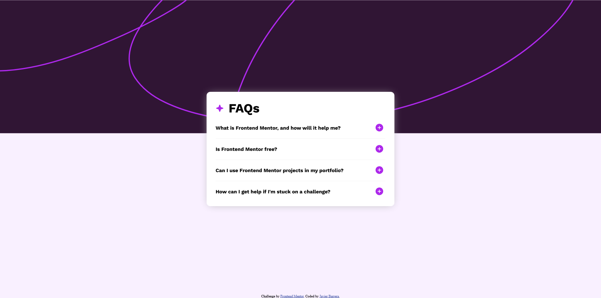

# Frontend Mentor - FAQ accordion solution

This is a solution to the [FAQ accordion challenge on Frontend Mentor](https://www.frontendmentor.io/challenges/faq-accordion-wyfFdeBwBz). Frontend Mentor challenges help you improve your coding skills by building realistic projects. 

## Table of contents

- [Overview](#overview)
  - [The challenge](#the-challenge)
  - [Screenshot](#screenshot)
  - [Links](#links)
- [My process](#my-process)
  - [Built with](#built-with)
  - [What I learned](#what-i-learned)
- [Author](#author)

## Overview

### The challenge

Users should be able to:

- Hide/Show the answer to a question when the question is clicked
- Navigate the questions and hide/show answers using keyboard navigation alone
- View the optimal layout for the interface depending on their device's screen size
- See hover and focus states for all interactive elements on the page

### Screenshot



### Links

- Solution URL: [https://github.com/javierb256/FAQ-accordian](https://github.com/javierb256/FAQ-accordian)
- Live Site URL: [https://javierb256.github.io/FAQ-accordian/](https://javierb256.github.io/FAQ-accordian/)

## My process

### Built with

- Semantic HTML5 markup
- CSS custom properties
- Flexbox

### What I learned

I needed to add a function to every li inside the accordion ul element. To do this I targeted the ul element then extracted all of its children. After doing this I looped through each element within the returned object and gave each of them a function that would toggle clicked question as well as change the icon on the right.

```html
<ul class="accordion">
        <li id="question1" class="questionGroup"></li>
</ul>
```

```js
const accordion = document.querySelector(".accordion").children;

for (let question of accordion) {
  question.addEventListener("click", () => {
    const image = question.getElementsByTagName("img")[0];
    question.children[1].classList.toggle("hidden");

    if (image.src === img1) {
      image.src = img2;
    } else {
      image.src = img1;
    }
  });
}
```

## Author

- Website - [https://javierbarrera.dev/](https://javierbarrera.dev/)
- Frontend Mentor - [@javierb256](https://www.frontendmentor.io/profile/javierb256)
